<p align="center">
  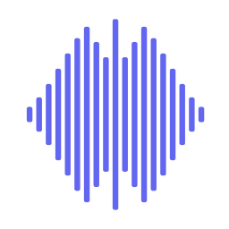
</p>

<h1 align="center">Sonance</h1>

<p align="center">
  <strong>A self-hosted web music player for your personal audio library.</strong><br/>
  Scan your FLAC, MP3, OGG, and M4A collection. Browse by album and artist. Play from any browser with gapless playback, crossfade, EQ, visualizers, scrobbling, and more.
</p>

<p align="center">
  
  
  
  
  
  
  
</p>

---

<p align="center">
  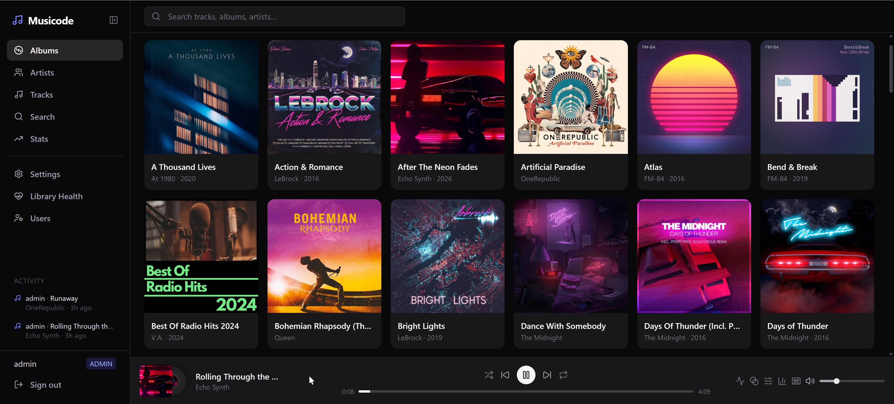
</p>
<p align="center"><em>Browse your library by album, artist, or track — with real-time activity feed and persistent player bar.</em></p>

## Highlights

| | Feature | Description |
|---|---|---|
| :headphones: | **Gapless & Crossfade** | Dual HTMLAudioElement engine with pre-loading and configurable 0-12s crossfade |
| :musical_score: | **5-Band EQ** | Parametric equalizer (60 Hz - 14 kHz) with 5 presets |
| :bar_chart: | **4 Visualizers** | Frequency bars, waveform, circular, and vinyl — all driven by Web Audio API |
| :vhs: | **Cassette Deck** | Full retro mode with animated reels, VU meters, odometer, and 3 visual themes |
| :microphone: | **Synced Lyrics** | Auto-scrolling lyrics panel with LRC timing support |
| :cd: | **Scrobbling** | Last.fm + ListenBrainz integration with async retry |
| :chart_with_upwards_trend: | **Listening Stats** | Top artists/albums/tracks, plays-per-day chart, period filtering |
| :performing_arts: | **Dynamic Colors** | UI theme extracted from album artwork with saturation-weighted scoring |
| :ocean: | **Waveform Seek Bar** | Server-generated audio waveform as the progress bar |
| :busts_in_silhouette: | **Multi-User** | JWT auth with ADMIN/LISTENER roles, per-user scrobble config |
| :satellite: | **Activity Feed** | Real-time SSE stream showing what users are listening to |
| :iphone: | **Responsive** | Collapsible sidebar, adaptive player bar, desktop to tablet |

---

## Architecture

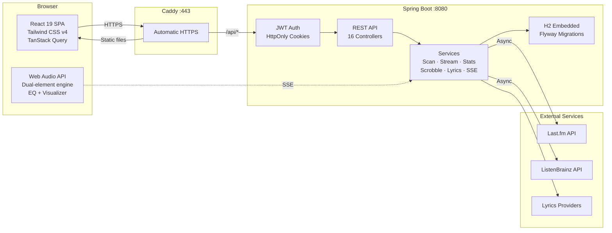

### Stack

| Layer | Technology |
|---|---|
| **Frontend** | React 19 + Vite 8 + TypeScript + Tailwind CSS v4 |
| **Backend** | Spring Boot 3.4 + Java 21 + Maven |
| **Database** | H2 (embedded, zero config) + Flyway migrations |
| **Audio Engine** | Web Audio API (dual HTMLAudioElement + AudioContext graph) |
| **Metadata** | JAudioTagger 2.2.5 (FLAC, MP3, OGG, M4A) |
| **Auth** | Spring Security + JWT in HttpOnly cookies |
| **Proxy** | Caddy (automatic HTTPS + static file serving) |
| **Containers** | Docker Compose (multi-stage builds) |
| **Tests** | JUnit 5 + WireMock + Vitest + Playwright |

---

## Quick Start

### Docker Compose (production)

```bash
cp .env.example .env
# Edit .env — set MUSIC_DIR to your music folder

docker compose up --build
```

Open `https://localhost`. Default credentials: `admin` / `changeme`.

### Development

```bash
# Backend
cd sonance-server
mvn spring-boot:run
# http://localhost:8080 | Swagger UI: http://localhost:8080/swagger-ui.html

# Frontend
cd sonance-ui
npm install && npm run dev
# http://localhost:5173 (proxies /api to :8080)
```

---

## Features in Depth

### Audio Engine

The player runs on a **dual-element Web Audio graph** — two persistent HTMLAudioElements wired through independent gain nodes into a shared processing chain.

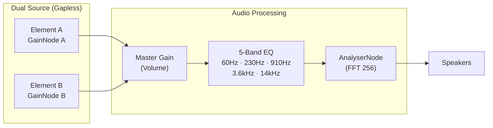

**How gapless works:** While track A plays, the inactive element B pre-loads the next track. At transition time, gain A ramps to 0 and gain B ramps to 1 — either instantly (gapless) or over a configurable duration (crossfade). No disconnect/reconnect race conditions.

### Visualizer Modes

<p align="center">
  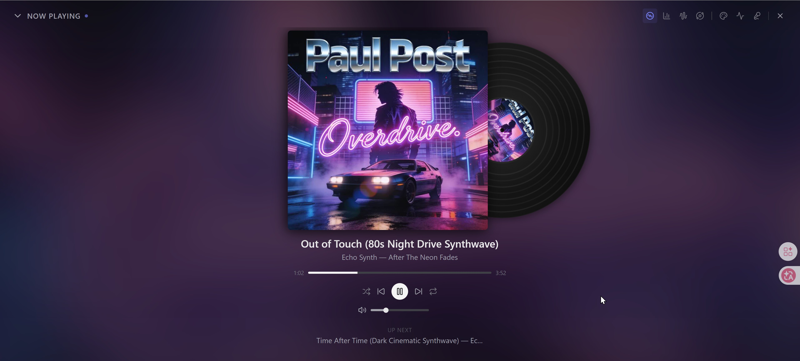
</p>
<p align="center"><em>Vinyl visualizer with album-extracted dynamic colors.</em></p>

| Mode | How it works |
|---|---|
| **Frequency Bars** | FFT frequency data → vertical bars with HSL coloring by amplitude |
| **Waveform** | Time-domain data with temporal smoothing (lerp 0.25) and glow effect |
| **Circular** | Radial frequency bars (64 bins) with inner glow gradient |
| **Vinyl** | CSS-animated spinning disc with cover art, slides out on play |

All canvas-based modes run at 60fps via `requestAnimationFrame`, pause on page visibility change, and fade out gracefully when playback stops.

### Cassette Deck (Retro Mode)

<p align="center">
  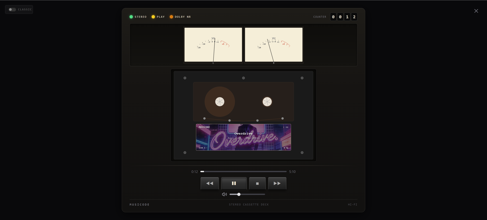
</p>

Full-screen retro cassette experience:

- **Animated reels** — Angular velocity inversely proportional to tape radius (realistic winding)
- **VU meters** — Frequency data drives needle deflection
- **Mechanical odometer** — Digit-by-digit rolling counter
- **LED indicators** — Play/pause/record state
- **3 visual themes** — Switch deck aesthetics on the fly
- **Cover art on cassette label** — With text overlay and shadow effects

### Dynamic Color Extraction

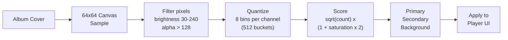

Colors extracted from album artwork adapt the entire player UI — progress bar, visualizer, overlay background, and cassette deck. Saturation-weighted scoring prevents washed-out grays from dominating.

### Synced Lyrics

<p align="center">
  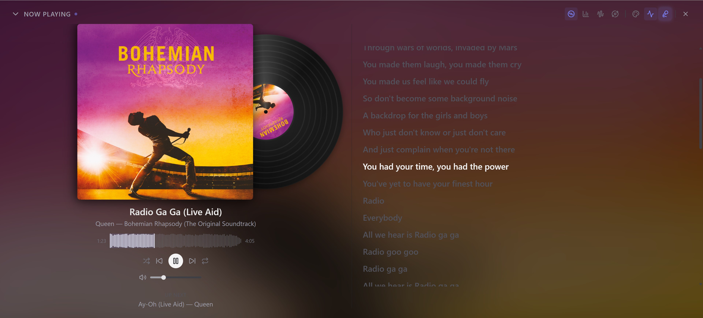
</p>
<p align="center"><em>Synced lyrics with waveform seek bar and vinyl visualizer.</em></p>

- LRC format parsing with millisecond timing
- Auto-scroll to the active line during playback
- Manual scroll temporarily disables auto-scroll (4s cooldown)
- States: Loading, Not Found, Instrumental, Synced, Plain Text
- Retry button for failed fetches

### Listening Stats & Scrobbling

<!-- Stats screenshot pending — waiting for more listening data -->

**Play tracking** fires at 50% of track duration — no accidental skips counted.

| Feature | Detail |
|---|---|
| **Summary cards** | Total plays, listening time, unique artists, unique albums |
| **Daily chart** | Plays-per-day bar chart (Recharts) |
| **Top lists** | Top artists, albums, and tracks with play counts |
| **Period filter** | Week, Month, Year, All Time |
| **Last.fm scrobble** | Async with exponential backoff (1s → 2s → 4s, max 3 retries) |
| **ListenBrainz** | Same async retry strategy, per-user token config |

### Library Scan

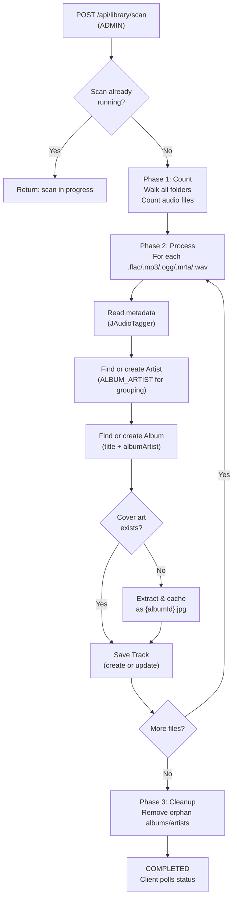

Albums are grouped by `ALBUM_ARTIST` tag — compilations with different track artists stay as one album instead of fragmenting.

### Authentication

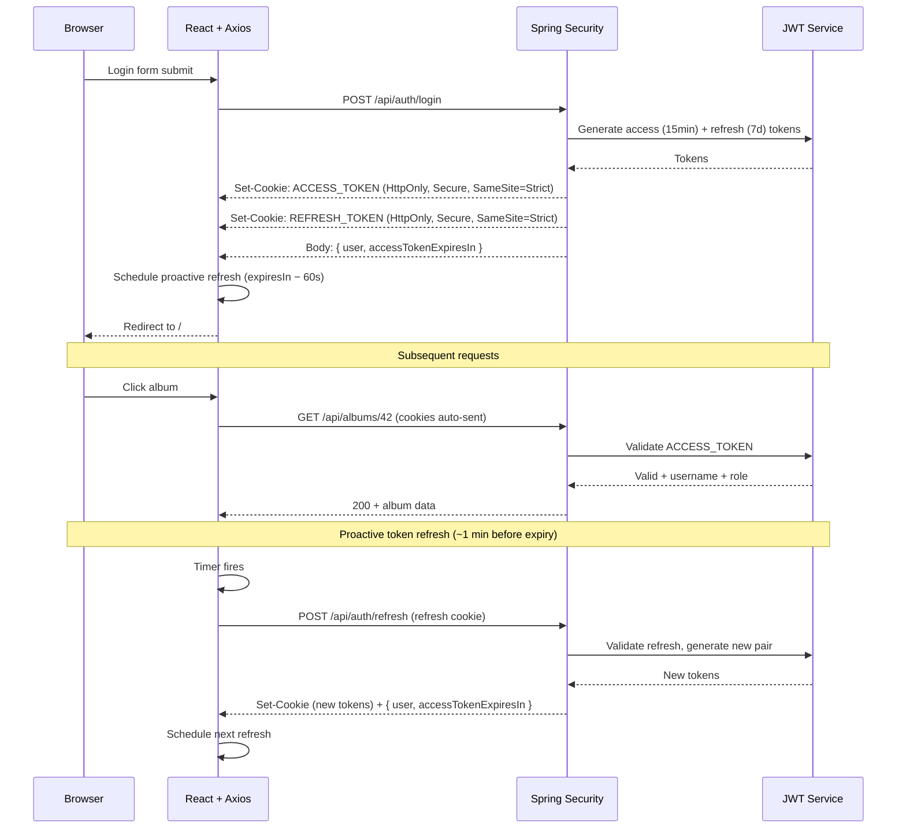

- **HttpOnly cookies** — JavaScript never touches tokens (XSS protection)
- **SameSite=Strict** — Cookies not sent on cross-origin requests (CSRF protection)
- **Proactive refresh** — Timer refreshes tokens ~1 min before expiry, so `<audio>` and SSE streams (which bypass axios interceptors) never hit a 401
- **Reactive fallback** — Axios interceptor still queues and retries on unexpected 401s

### Activity Feed (Real-Time SSE)

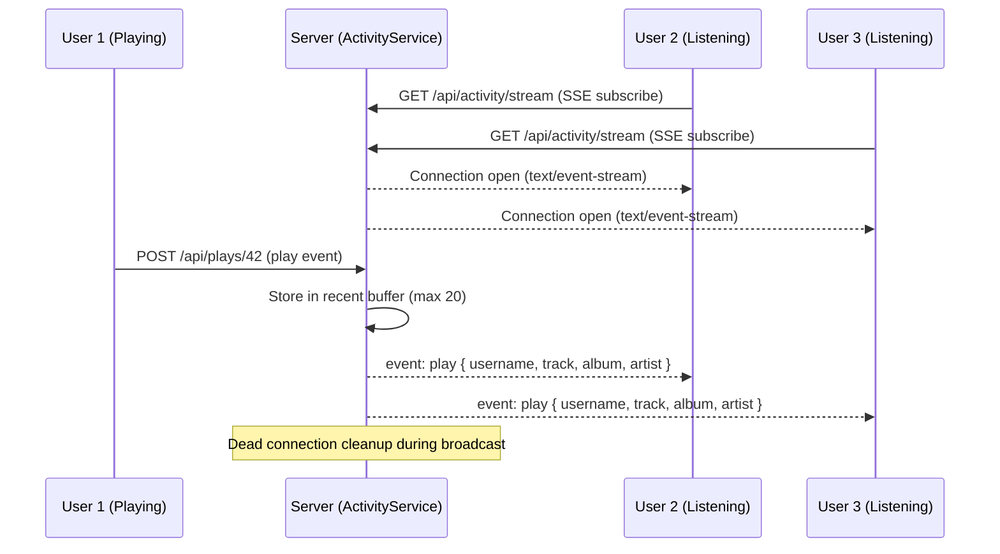

---

## Project Structure

```
sonance/
├── sonance-server/          Spring Boot backend (see server README)
│   ├── src/main/java/        16 controllers, 17 services, 9 entities
│   ├── src/test/java/        272 tests (unit + integration + WireMock)
│   └── pom.xml               Maven build with JaCoCo ≥80%
├── sonance-ui/              React frontend (see UI README)
│   ├── src/                  Components, hooks, audio pipeline, pages
│   ├── e2e/                  21 Playwright E2E tests
│   └── package.json          Vite 8, Vitest, Tailwind v4
├── caddy/                    Caddy Dockerfile
├── Caddyfile                 Reverse proxy + static serving config
├── docker-compose.yml        Full stack orchestration
├── .env.example              Environment variable template
├── SCROBBLING.md             Scrobbling credentials guide
├── .github/workflows/ci.yml  CI pipeline
└── .gsd/                     Project management artifacts
```

---

## Configuration

| Variable | Default | Description |
|---|---|---|
| `MUSIC_DIR` | _(required)_ | Host path to music library (mounted read-only) |
| `SONANCE_ADMIN_PASSWORD` | `changeme` | Initial admin password |
| `SONANCE_JWT_SECRET` | _(required)_ | JWT signing key (≥32 chars) |
| `SONANCE_TOKEN_ENCRYPTION_KEY` | _(required)_ | AES-256-GCM key for encrypting scrobble tokens at rest |
| `LASTFM_API_KEY` | _(optional)_ | Last.fm API key for scrobbling |
| `LASTFM_API_SECRET` | _(optional)_ | Last.fm API secret for scrobbling |

See `.env.example` for full documentation. See `SCROBBLING.md` for Last.fm/ListenBrainz setup guide.

---

## Tests

```bash
# Backend — 272 tests (unit + integration + WireMock contract)
cd sonance-server && mvn clean verify     # JaCoCo ≥80% enforced

# Frontend — 117 unit tests
cd sonance-ui && npm run test:coverage    # Vitest v8 coverage thresholds

# E2E — 21 Playwright tests (requires backend on :8080)
cd sonance-ui && npm run test:e2e
```

| Suite | Count | What it covers |
|---|---|---|
| **Backend unit** | ~120 | Service logic, DTO mapping, utilities |
| **Backend integration** | ~110 | Controller endpoints, auth flows, DB queries |
| **Backend contract** | ~40 | WireMock stubs for Last.fm + ListenBrainz wire format |
| **Frontend unit** | 117 | Components, contexts, hooks, error handling |
| **E2E (Playwright)** | 21 | Auth, browse, playback, admin, search, stats, settings |

---

## More Screenshots

<p align="center">
  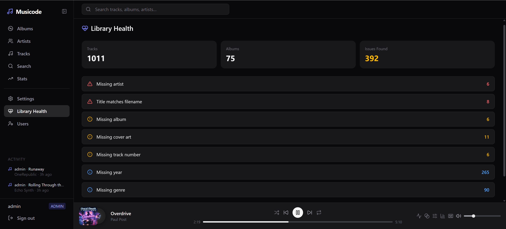
</p>
<p align="center"><em>Library Health dashboard — detect metadata issues, missing covers, and orphan files.</em></p>

### Responsive Layout

<p align="center">
  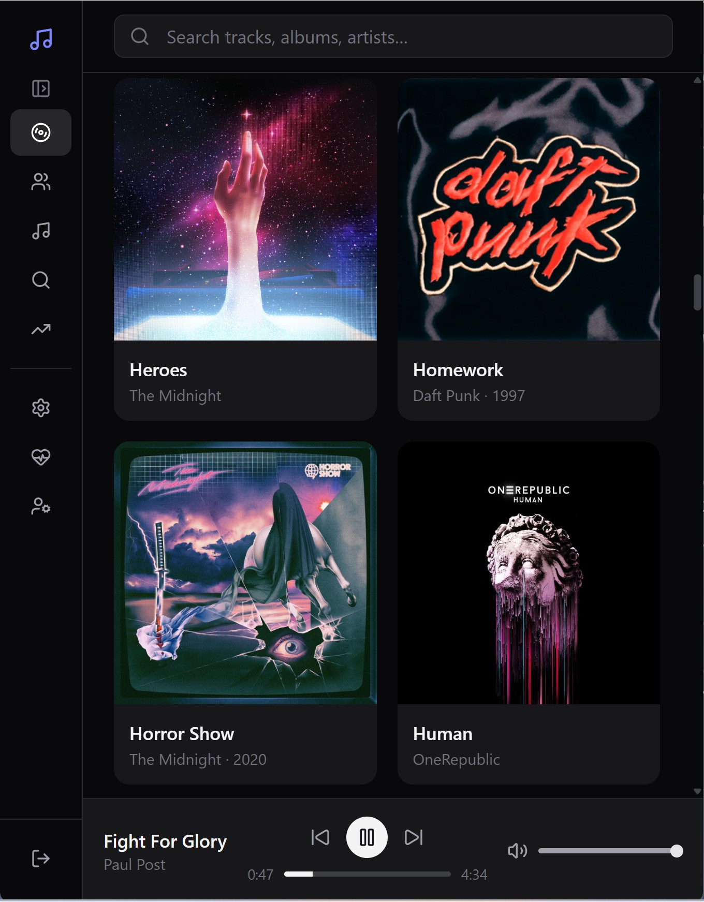
  &nbsp;&nbsp;&nbsp;
  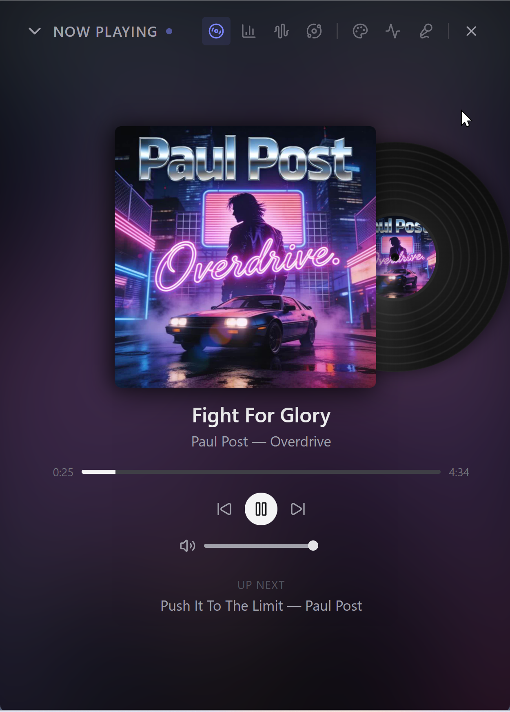
</p>
<p align="center"><em>Fully responsive — collapsible icon sidebar, adaptive player bar, and full Now Playing on mobile.</em></p>

---

## License

Personal project. Not licensed for redistribution.
