<p align="center">
  
</p>

<h1 align="center">Sonance</h1>

<p align="center">
  <strong>A personal music streaming app for your audio library.</strong><br/>
  Scan your FLAC, MP3, OGG, M4A, and WAV collection. Stream to any browser or run as a desktop app with gapless playback, crossfade, parametric EQ, audio analysis, scrobbling, and more.
</p>

<p align="center">
  
  
  
  
  
  
  
  
</p>

> **Learning project** — Sonance is a personal project built to learn about audio streaming,
> full-stack architecture, and AI-assisted development workflows (GSD).
> No commercial goals, just curiosity and craft.

---

<p align="center">
  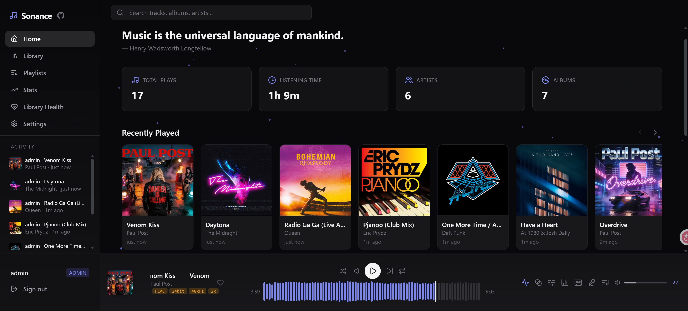
</p>
<p align="center"><em>Home dashboard — recently played, top artists, quick stats, and persistent player bar.</em></p>

## Highlights

| | Feature | Description |
|---|---|---|
| :headphones: | **Gapless & Crossfade** | Dual HTMLAudioElement engine with pre-loading and configurable 0-12s crossfade |
| :musical_score: | **Parametric EQ** | 1-10 band parametric equalizer with 6 built-in presets and custom preset save/export/import |
| :bar_chart: | **4 Visualizers** | Frequency bars, waveform, circular, and vinyl — all driven by Web Audio API |
| :film_strip: | **Analyzer Deck** | 8 professional audio scopes: spectrum analyzer, spectrogram, vectorscope, oscilloscope, VU meter, LUFS meter, classic bars, waveform — resizable, configurable FFT |
| :vhs: | **Cassette Deck** | Full retro mode with animated reels, VU meters, odometer, and 3 visual themes |
| :microphone: | **Synced Lyrics** | Auto-scrolling lyrics panel with LRC timing support |
| :cd: | **Scrobbling** | Last.fm + ListenBrainz integration with async retry |
| :chart_with_upwards_trend: | **Listening Stats** | Top artists/albums/tracks, plays-per-day chart, period filtering |
| :performing_arts: | **3 Shells + 9 Palettes** | Evolved (full sidebar), Nova (icon sidebar), Minimal (top nav) — each with 9 color palettes |
| :art: | **Dynamic Colors** | UI theme extracted from album artwork with saturation-weighted scoring |
| :ocean: | **Waveform Seek Bar** | Server-generated audio waveform as the progress bar |
| :busts_in_silhouette: | **Multi-User** | JWT auth with ADMIN/LISTENER roles, per-user scrobble config |
| :heart: | **Favorites** | Heart any track — persisted per user, filterable in library |
| :clipboard: | **Playlists** | Create, reorder, drag-and-drop — with context menu integration |
| :notes: | **Queue Panel** | View, reorder, and clear the playback queue on the fly |
| :satellite: | **Activity Feed** | Real-time SSE stream showing what users are listening to |
| :house: | **Home Dashboard** | Recently played, top artists, quick stats — personalized landing page |
| :desktop_computer: | **Desktop App** | Electron wrapper with Spring Boot sidecar, media keys, and system tray |
| :iphone: | **Responsive** | Container queries adapt the player bar per-shell; works from maximized to compact windows |

---

## Architecture

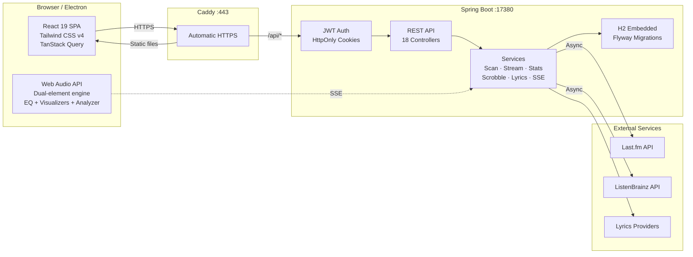
```mermaid
graph LR
    subgraph Client ["Browser / Electron"]
        React["React 19 SPA<br/>Tailwind CSS v4<br/>TanStack Query"]
        WebAudio["Web Audio API<br/>Dual-element engine<br/>EQ + Visualizers + Analyzer"]
    end

    subgraph Proxy ["Caddy :443"]
        TLS["Automatic HTTPS"]
    end

    subgraph Server ["Spring Boot :17380"]
        Security["JWT Auth<br/>HttpOnly Cookies"]
        API["REST API<br/>18 Controllers"]
        Services["Services<br/>Scan · Stream · Stats<br/>Scrobble · Lyrics · SSE"]
        DB["H2 Embedded<br/>Flyway Migrations"]
    end

    subgraph External ["External Services"]
        LastFM["Last.fm API"]
        LB["ListenBrainz API"]
        Lyrics["Lyrics Providers"]
    end

    React -->|HTTPS| TLS
    TLS -->|/api/*| Security
    TLS -->|Static files| React
    Security --> API --> Services
    Services --> DB
    Services -->|Async| LastFM
    Services -->|Async| LB
    Services --> Lyrics
    WebAudio -.->|SSE| Services
```

### Stack

| Layer | Technology |
|---|---|
| **Desktop** | Electron 33 (BrowserWindow + Spring Boot sidecar) |
| **Frontend** | React 19 + Vite 8 + TypeScript 5.9 + Tailwind CSS v4 |
| **Backend** | Spring Boot 3.4.4 + Java 21 + Maven |
| **Database** | H2 (embedded, zero config) + Flyway migrations |
| **Audio Engine** | Web Audio API (dual HTMLAudioElement + AudioContext graph) |
| **Audio Analysis** | AnalyserNode with configurable FFT (1024–16384), 8 canvas scopes |
| **Metadata** | JAudioTagger 2.2.5 (FLAC, MP3, OGG, M4A, WAV) |
| **Auth** | Spring Security + JWT in HttpOnly cookies |
| **Proxy** | Caddy (automatic HTTPS + static file serving, server mode) |
| **Containers** | Docker Compose (multi-stage builds, server mode) |
| **Animations** | GSAP (page transitions) + tsParticles (login background) |
| **Tests** | JUnit 5 + WireMock + Vitest + Playwright |

---

## Quick Start

### Desktop App (recommended)

```bash
cd sonance-desktop
npm install
npm run download-jre       # Downloads Adoptium JRE 21
npm run dist               # Builds React + Spring Boot JAR + Electron installer
```

Run `dist/win-unpacked/Sonance.exe`. The app starts a local Spring Boot server, shows a loading screen, and opens the full UI once ready.

**Required environment variable:** `SONANCE_TOKEN_ENCRYPTION_KEY` — generate with `openssl rand -hex 32`.

> See [sonance-desktop/README.md](sonance-desktop/README.md) for full build and packaging details.

### Docker Compose (server mode)

```bash
cp .env.example .env
# Edit .env — set MUSIC_DIR to your music folder

docker compose up --build
```

Open `https://localhost`. Default credentials: `admin` / `changeme`.

### Development

```bash
# Backend
cd sonance-server
mvn spring-boot:run
# http://localhost:17380 | Swagger UI: http://localhost:17380/swagger-ui.html

# Frontend (separate terminal)
cd sonance-ui
npm install && npm run dev
# http://localhost:17381 (proxies /api to :17380)

# Desktop (Electron wrapper, optional)
cd sonance-desktop
npm start
# Opens Electron window loading Vite dev server + hot reload
```

---

## Features in Depth

### Audio Engine

The player runs on a **dual-element Web Audio graph** — two persistent HTMLAudioElements wired through independent gain nodes into a shared processing chain.

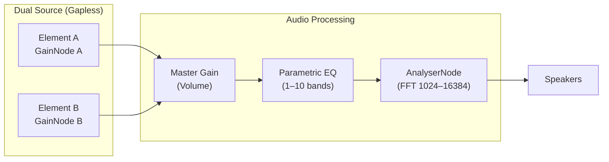
```mermaid
graph LR
    subgraph Sources ["Dual Source (Gapless)"]
        A["Element A<br/>GainNode A"]
        B["Element B<br/>GainNode B"]
    end

    subgraph Processing ["Audio Processing"]
        Master["Master Gain<br/>(Volume)"]
        EQ["Parametric EQ<br/>(1–10 bands)"]
        Analyser["AnalyserNode<br/>(FFT 1024–16384)"]
    end

    Dest["Speakers"]

    A --> Master
    B --> Master
    Master --> EQ --> Analyser --> Dest
```

**How gapless works:** While track A plays, the inactive element B pre-loads the next track. At transition time, gain A ramps to 0 and gain B ramps to 1 — either instantly (gapless) or over a configurable duration (crossfade). No disconnect/reconnect race conditions.

### Parametric EQ

<p align="center">
  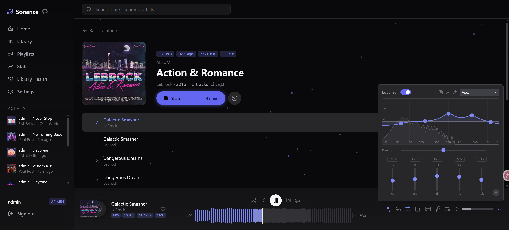
</p>
<p align="center"><em>Parametric EQ — custom curve with draggable frequency/gain nodes.</em></p>

The equalizer supports **1 to 10 bands** with per-band frequency, gain (-12 to +12 dB), Q factor, and filter type (lowshelf, peaking, highshelf). Six built-in presets (Flat, Bass Boost, Treble Boost, Vocal, Rock, Loudness) plus a full custom preset system:

- **Save** custom presets with a name
- **Export** presets to JSON files
- **Import** presets from JSON files
- **Per-band preamp** for gain compensation

### Visualizer Modes

<p align="center">
  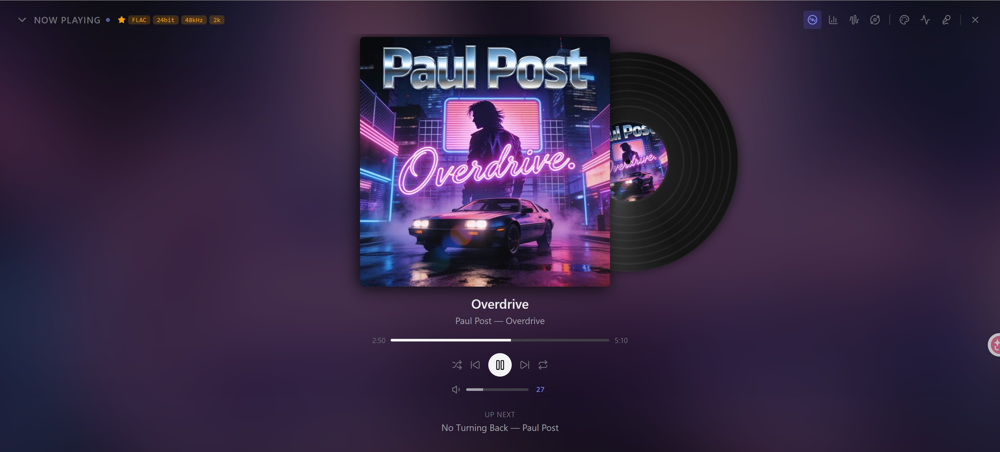
</p>
<p align="center"><em>Vinyl visualizer with album-extracted dynamic colors.</em></p>

| Mode | How it works |
|---|---|
| **Frequency Bars** | FFT frequency data → vertical bars with HSL coloring by amplitude |
| **Waveform** | Time-domain data with temporal smoothing (lerp 0.25) and glow effect |
| **Circular** | Radial frequency bars (64 bins) with inner glow gradient |
| **Vinyl** | CSS-animated spinning disc with cover art, slides out on play |

All canvas-based modes run at 60fps via `requestAnimationFrame`, pause on page visibility change, and fade out gracefully when playback stops.

### Analyzer Deck

<p align="center">
  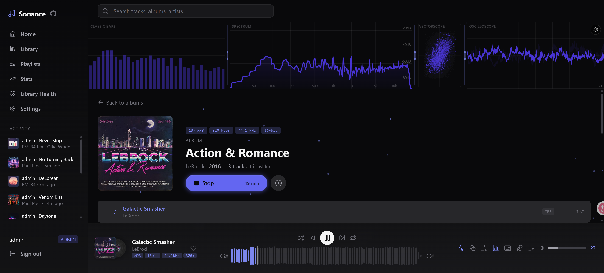
</p>
<p align="center"><em>Analyzer Deck — spectrum, vectorscope, spectrogram, and oscilloscope running simultaneously.</em></p>

Eight professional audio analysis scopes in a resizable, collapsible panel:

| Scope | What it shows |
|---|---|
| **Classic Bars** | Traditional frequency bar visualization |
| **Spectrum Analyzer** | Detailed frequency spectrum with configurable resolution |
| **Vectorscope** | Stereo field analysis (Lissajous or polar mode) |
| **Oscilloscope** | Time-domain waveform with adjustable speed |
| **Spectrogram** | Frequency over time as a heat-mapped waterfall |
| **VU Meter** | Signal level with bars or needle display mode |
| **LUFS Meter** | Loudness metering (integrated loudness standard) |
| **Waveform** | Scrolling waveform with configurable speed |

- Configurable FFT size (1024, 2048, 4096, 8192, 16384)
- Resizable panes with drag handles and per-scope proportions
- Add, remove, and reorder scopes at will

### Cassette Deck (Retro Mode)

<p align="center">
  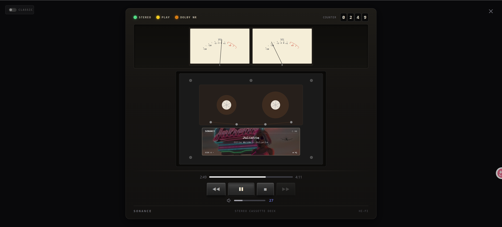
</p>

Full-screen retro cassette experience:

- **Animated reels** — Angular velocity inversely proportional to tape radius (realistic winding)
- **VU meters** — Frequency data drives needle deflection
- **Mechanical odometer** — Digit-by-digit rolling counter
- **LED indicators** — Play/pause/record state
- **3 visual themes** — Classic, Indigo, and Synthwave
- **Cover art on cassette label** — With text overlay and shadow effects

### UI System: Shells & Palettes

Three distinct layout shells, each with a different navigation paradigm:

| Shell | Layout | Best for |
|---|---|---|
| **Evolved** | Full sidebar with labels (224px) | Desktop, wide screens |
| **Nova** | Icon-only sidebar (56px) | Moderate width, more content space |
| **Minimal** | Top navigation bar, no sidebar | Compact layouts, maximum content area |

Nine color palettes — **Indigo** (default), Zinc, Crimson, Emerald, Amber, Cyan, Daylight, Sunrise, Frost — applied globally via CSS custom properties through `ThemeProvider`.

<p align="center">
  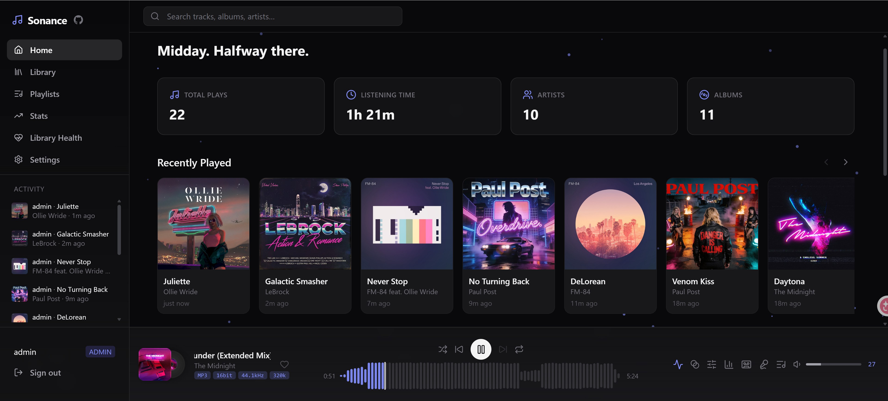
  &nbsp;
  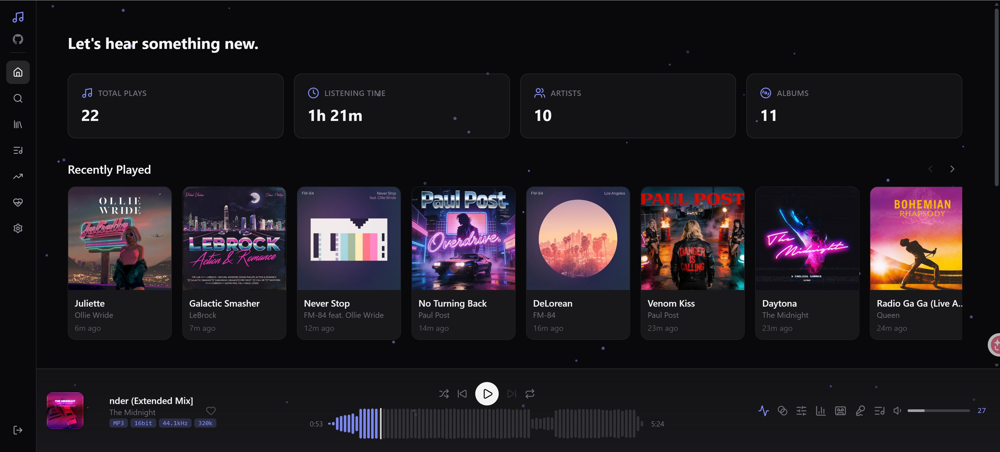
  &nbsp;
  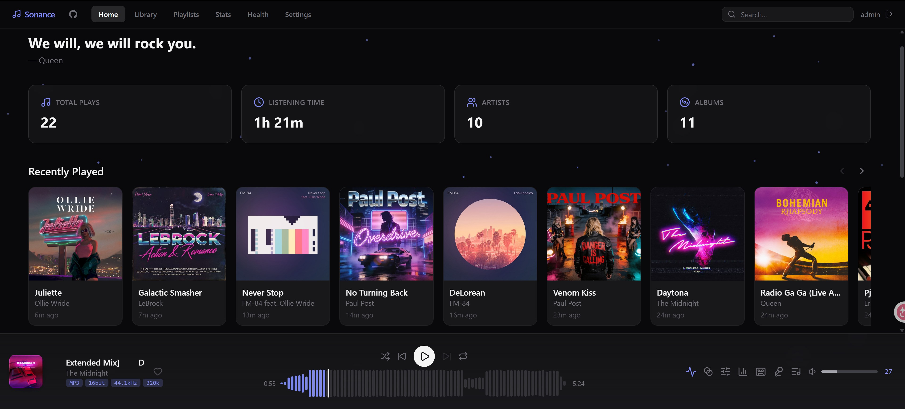
</p>
<p align="center"><em>Left to right: Evolved, Nova, and Minimal shells.</em></p>

**Dynamic colors** extracted from album artwork override the palette while playing, adapting the player bar, visualizers, and overlay background.

### Dynamic Color Extraction

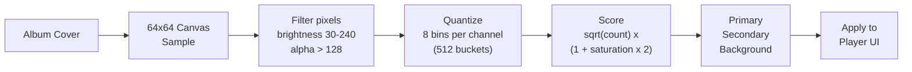
```mermaid
graph LR
    Cover["Album Cover"] --> Sample["64x64 Canvas<br/>Sample"]
    Sample --> Filter["Filter pixels<br/>brightness 30-240<br/>alpha > 128"]
    Filter --> Bucket["Quantize<br/>8 bins per channel<br/>(512 buckets)"]
    Bucket --> Score["Score<br/>sqrt(count) x<br/>(1 + saturation x 2)"]
    Score --> Palette["Primary<br/>Secondary<br/>Background"]
    Palette --> UI["Apply to<br/>Player UI"]
```

### Synced Lyrics

<p align="center">
  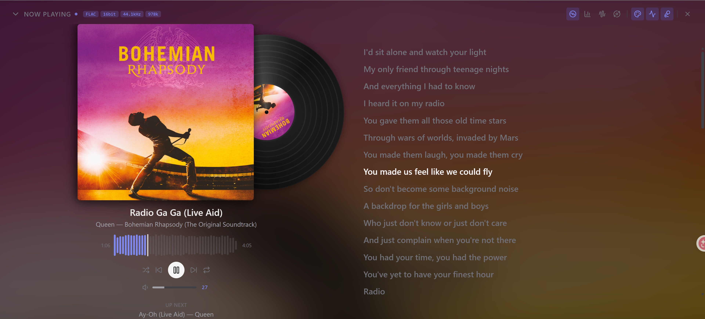
</p>
<p align="center"><em>Synced lyrics with waveform seek bar and vinyl visualizer.</em></p>

- LRC format parsing with millisecond timing
- Auto-scroll to the active line during playback
- Manual scroll temporarily disables auto-scroll (4s cooldown)
- States: Loading, Not Found, Instrumental, Synced, Plain Text
- Retry button for failed fetches

### Favorites & Playlists

<p align="center">
  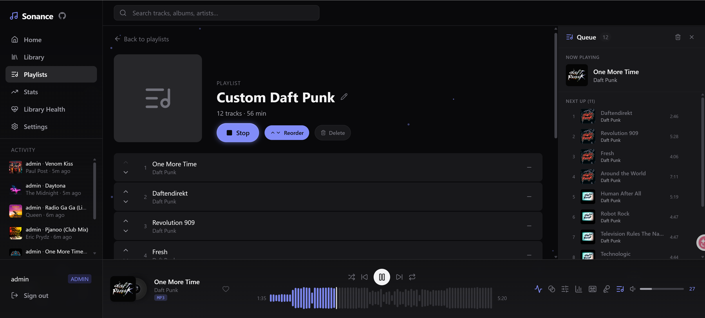
</p>
<p align="center"><em>Playlist detail — drag-and-drop reorder with sidebar playlist list.</em></p>

**Favorites** — heart any track from anywhere in the UI; favorites are per-user and persisted on the server. **Playlists** — create, rename, delete playlists with drag-and-drop track reorder and context menu integration from album/track views.

### Queue Panel

<p align="center">
  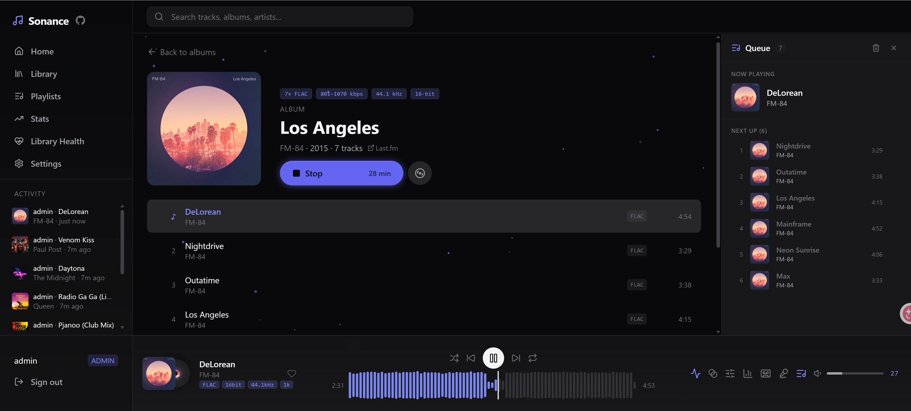
</p>
<p align="center"><em>Queue panel — view, reorder, and manage upcoming tracks.</em></p>

Slide-out panel showing the current playback queue. Reorder tracks, remove individual items, or clear the entire queue.

### Home Dashboard

<p align="center">
  
</p>
<p align="center"><em>Home — recently played, top artists, and listening stats at a glance.</em></p>

Personalized landing page with recently played tracks, top artists, and quick listening stats.

### Listening Stats & Scrobbling

<p align="center">
  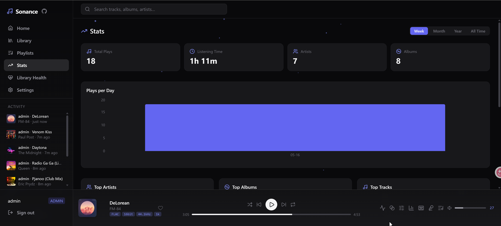
</p>
<p align="center">
  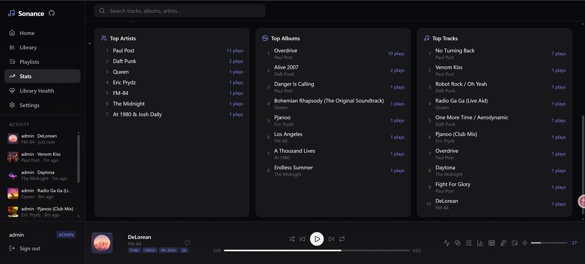
</p>
<p align="center"><em>Listening stats — summary cards, daily chart, top albums, and top artists.</em></p>

**Play tracking** fires at 50% of track duration — no accidental skips counted.

| Feature | Detail |
|---|---|
| **Summary cards** | Total plays, listening time, unique artists, unique albums |
| **Daily chart** | Plays-per-day bar chart (Recharts) |
| **Top lists** | Top artists, albums, and tracks with play counts |
| **Period filter** | Week, Month, Year, All Time |
| **Last.fm scrobble** | Async with exponential backoff (1s → 2s → 4s, max 3 retries) |
| **ListenBrainz** | Same async retry strategy, per-user token config |

### Library Scan

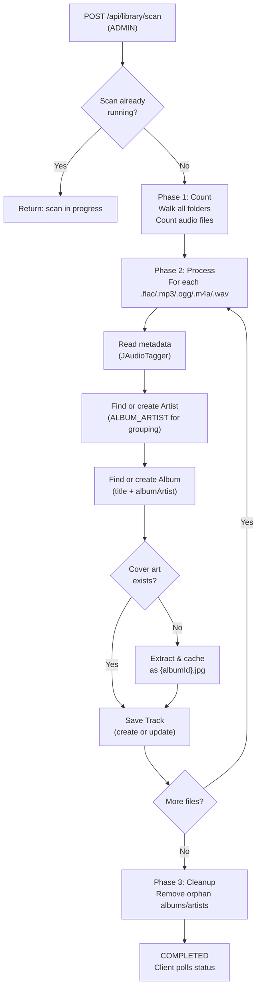
```mermaid
graph TD
    Start["POST /api/library/scan<br/>(ADMIN)"] --> Check{"Scan already<br/>running?"}
    Check -->|Yes| Skip["Return: scan in progress"]
    Check -->|No| Count["Phase 1: Count<br/>Walk all folders<br/>Count audio files"]
    Count --> Process["Phase 2: Process<br/>For each .flac/.mp3/.ogg/.m4a/.wav"]
    Process --> Meta["Read metadata<br/>(JAudioTagger)"]
    Meta --> Artist["Find or create Artist<br/>(ALBUM_ARTIST for grouping)"]
    Artist --> Album["Find or create Album<br/>(title + albumArtist)"]
    Album --> Cover{"Cover art<br/>exists?"}
    Cover -->|No| Extract["Extract & cache<br/>as {albumId}.jpg"]
    Cover -->|Yes| SaveTrack
    Extract --> SaveTrack["Save Track<br/>(create or update)"]
    SaveTrack --> Next{"More files?"}
    Next -->|Yes| Process
    Next -->|No| Cleanup["Phase 3: Cleanup<br/>Remove orphan albums/artists"]
    Cleanup --> Done["COMPLETED<br/>Client polls status"]
```

Albums are grouped by `ALBUM_ARTIST` tag — compilations with different track artists stay as one album instead of fragmenting.

### Authentication

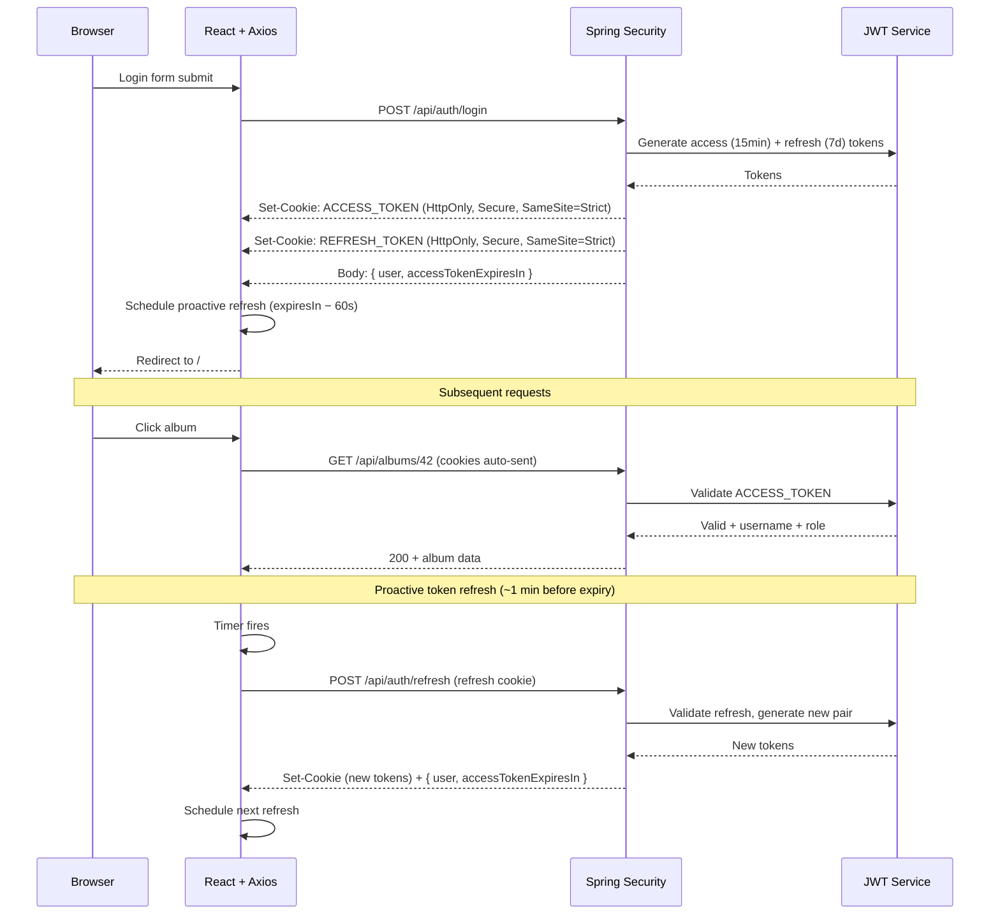
```mermaid
sequenceDiagram
    participant B as Browser
    participant R as React + Axios
    participant S as Spring Security
    participant J as JWT Service

    B->>R: Login form submit
    R->>S: POST /api/auth/login
    S->>J: Generate access (15min) + refresh (7d) tokens
    J-->>S: Tokens
    S-->>R: Set-Cookie: ACCESS_TOKEN (HttpOnly, Secure, SameSite=Strict)
    S-->>R: Set-Cookie: REFRESH_TOKEN (HttpOnly, Secure, SameSite=Strict)
    S-->>R: Body: { user, accessTokenExpiresIn }
    R->>R: Schedule proactive refresh (expiresIn − 60s)
    R-->>B: Redirect to /

    Note over B,J: Subsequent requests
    B->>R: Click album
    R->>S: GET /api/albums/42 (cookies auto-sent)
    S->>J: Validate ACCESS_TOKEN
    J-->>S: Valid + username + role
    S-->>R: 200 + album data

    Note over B,J: Proactive token refresh (~1 min before expiry)
    R->>R: Timer fires
    R->>S: POST /api/auth/refresh (refresh cookie)
    S->>J: Validate refresh, generate new pair
    J-->>S: New tokens
    S-->>R: Set-Cookie (new tokens) + { user, accessTokenExpiresIn }
    R->>R: Schedule next refresh
```

- **HttpOnly cookies** — JavaScript never touches tokens (XSS protection)
- **SameSite=Strict** — Cookies not sent on cross-origin requests (CSRF protection)
- **Proactive refresh** — Timer refreshes tokens ~1 min before expiry, so `<audio>` and SSE streams (which bypass axios interceptors) never hit a 401
- **Reactive fallback** — Axios interceptor still queues and retries on unexpected 401s

### Activity Feed (Real-Time SSE)

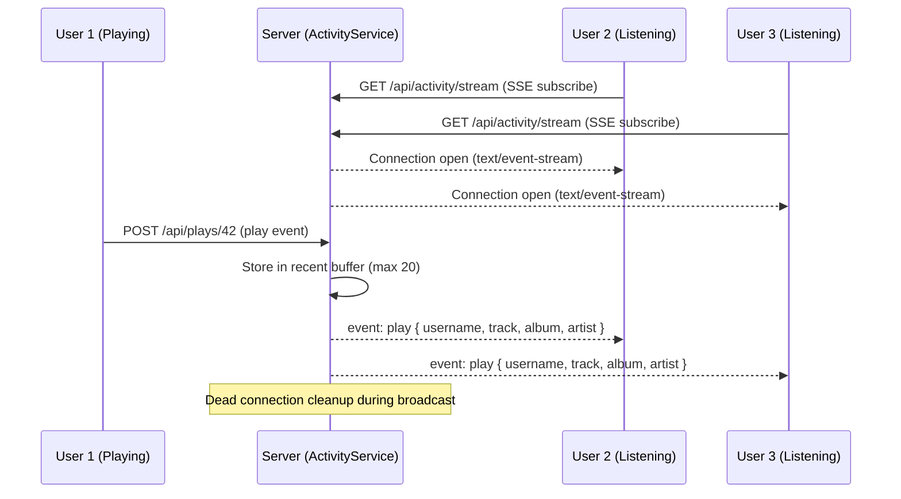
```mermaid
sequenceDiagram
    participant U1 as User 1 (Playing)
    participant S as Server (ActivityService)
    participant U2 as User 2 (Listening)
    participant U3 as User 3 (Listening)

    U2->>S: GET /api/activity/stream (SSE subscribe)
    U3->>S: GET /api/activity/stream (SSE subscribe)
    S-->>U2: Connection open (text/event-stream)
    S-->>U3: Connection open (text/event-stream)

    U1->>S: POST /api/plays/42 (play event)
    S->>S: Store in recent buffer (max 20)
    S-->>U2: event: play { username, track, album, artist }
    S-->>U3: event: play { username, track, album, artist }

    Note over S: Dead connection cleanup during broadcast
```

### Responsive Design

The player bar uses **CSS container queries** instead of viewport media queries. This means the layout adapts to the actual available space within each shell:

| Shell | Sidebar width | Player bar space at 900px viewport |
|---|---|---|
| Evolved | 224px | ~676px |
| Nova | 56px | ~844px |
| Minimal | 0px | ~900px |

At narrow widths, cover art, tech badges, and secondary controls collapse progressively — the progress bar and playback controls always stay visible.

---

## Project Structure

```
sonance/
├── sonance-desktop/         Electron desktop shell (see desktop README)
│   ├── main.js              Main process (window, sidecar, media keys, tray)
│   ├── sidecar.js           Spring Boot JAR lifecycle manager
│   ├── preload.js           Context bridge (IPC for media keys)
│   ├── scripts/             Build & JRE download scripts
│   └── package.json         electron-builder config
├── sonance-server/          Spring Boot backend (see server README)
│   ├── src/main/java/        18 controllers, 18 services, 12 entities
│   ├── src/test/java/        282 tests (unit + integration + WireMock)
│   └── pom.xml               Maven build with JaCoCo ≥80%
├── sonance-ui/              React frontend (see UI README)
│   ├── src/                  Components, hooks, audio pipeline, themes, pages
│   ├── e2e/                  Playwright E2E tests (21 tests)
│   └── package.json          Vite 8, Vitest, Tailwind v4
├── caddy/                    Caddy Dockerfile
├── Caddyfile                 Reverse proxy + static serving config
├── docker-compose.yml        Full stack orchestration
├── .env.example              Environment variable template
├── SCROBBLING.md             Scrobbling credentials guide
├── .github/workflows/ci.yml  CI pipeline
└── .gsd/                     Project management artifacts
```

---

## Configuration

| Variable | Default | Description |
|---|---|---|
| `MUSIC_DIR` | _(required)_ | Host path to music library (mounted read-only) |
| `SONANCE_ADMIN_PASSWORD` | `changeme` | Initial admin password |
| `SONANCE_JWT_SECRET` | _(required)_ | JWT signing key (≥32 chars) |
| `SONANCE_TOKEN_ENCRYPTION_KEY` | _(required)_ | AES-256-GCM key for encrypting scrobble tokens at rest |
| `LASTFM_API_KEY` | _(optional)_ | Last.fm API key for scrobbling |
| `LASTFM_API_SECRET` | _(optional)_ | Last.fm API secret for scrobbling |

See `.env.example` for full documentation. See `SCROBBLING.md` for Last.fm/ListenBrainz setup guide.

---

## Tests

```bash
# Backend — 282 tests (unit + integration + WireMock contract)
cd sonance-server && mvn clean verify     # JaCoCo ≥80% enforced

# Frontend — 231 unit tests
cd sonance-ui && npm run test:coverage    # Vitest v8 coverage thresholds

# E2E — 21 Playwright tests (requires backend on :17380)
cd sonance-ui && npm run test:e2e
```

| Suite | Count | What it covers |
|---|---|---|
| **Backend unit** | ~130 | Service logic, DTO mapping, utilities, filters |
| **Backend integration** | ~110 | Controller endpoints, auth flows, DB queries |
| **Backend contract** | ~40 | WireMock stubs for Last.fm + ListenBrainz wire format |
| **Frontend unit** | 231 | Components, contexts, hooks, pages, audio pipeline |
| **E2E (Playwright)** | 21 | Auth, browse, playback, admin, search, stats, settings |

---

## More Screenshots

<p align="center">
  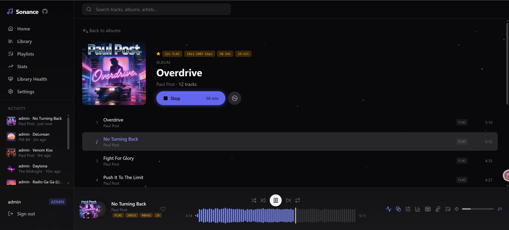
</p>
<p align="center"><em>Album detail — cover art, track list with duration, and player bar.</em></p>

<p align="center">
  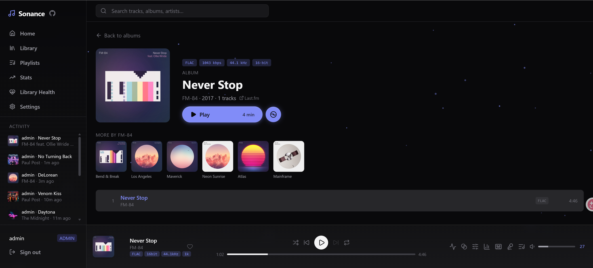
</p>
<p align="center"><em>Artist page — discography grid with album covers.</em></p>

<p align="center">
  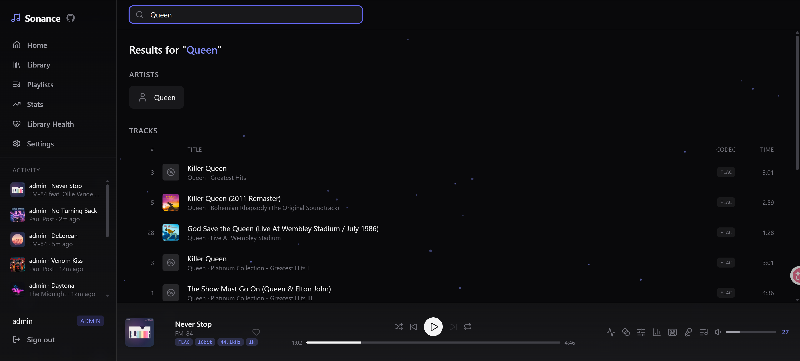
</p>
<p align="center"><em>Search — results across tracks, albums, and artists.</em></p>

<p align="center">
  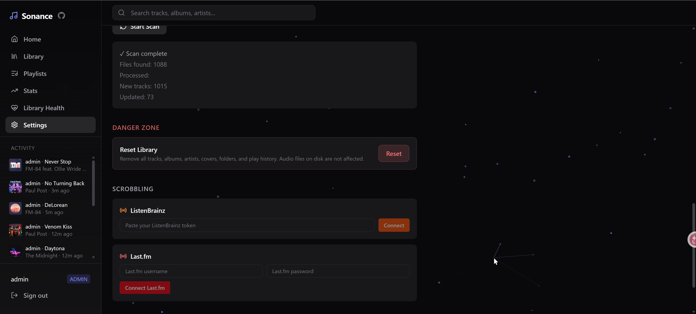
</p>
<p align="center"><em>Settings — scrobble configuration and app preferences.</em></p>

<p align="center">
  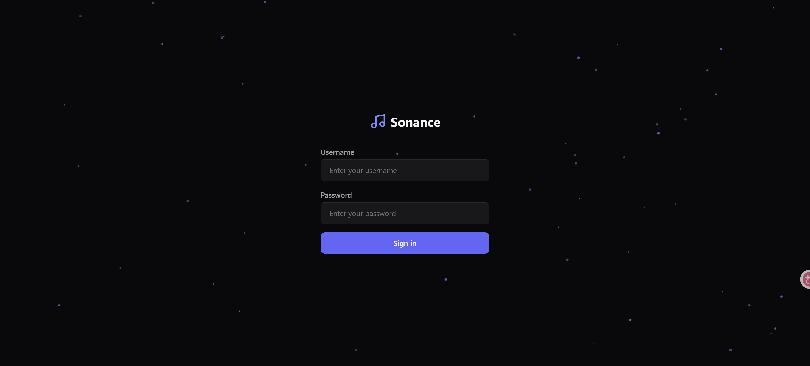
</p>
<p align="center"><em>Login — particle background with dark theme.</em></p>

<p align="center">
  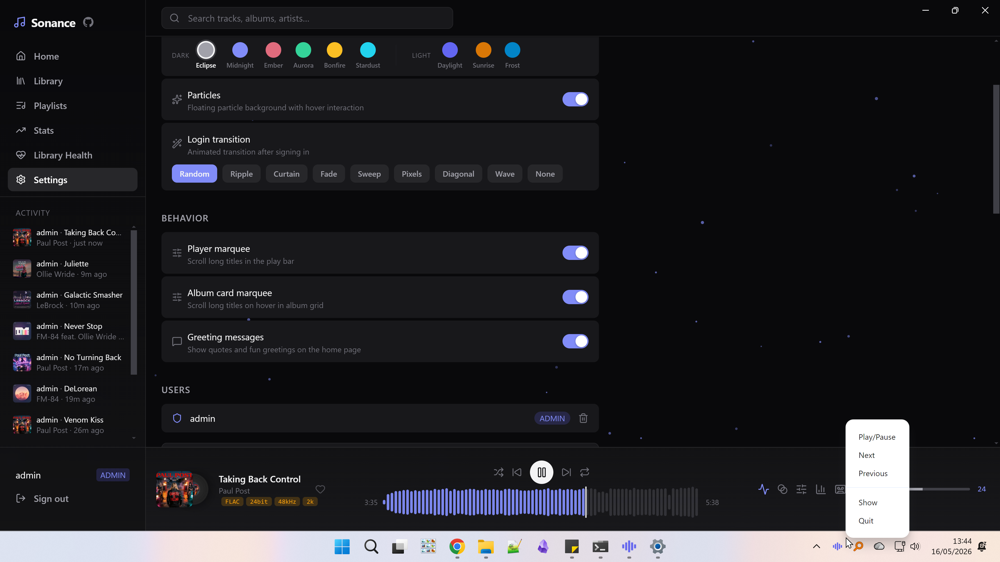
</p>
<p align="center"><em>Desktop app — Electron wrapper with system tray integration.</em></p>

<p align="center">
  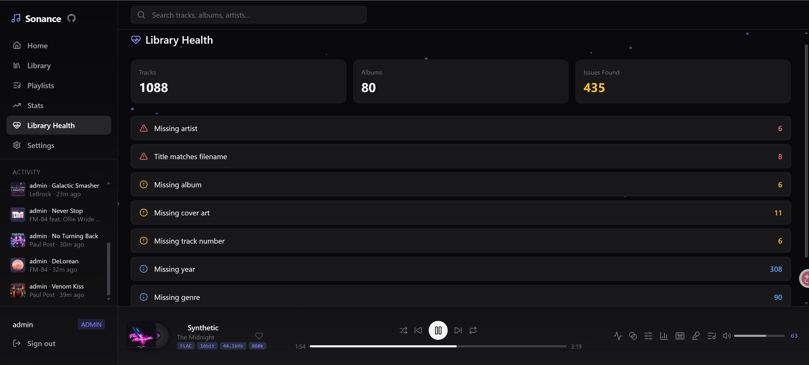
</p>
<p align="center"><em>Track metadata — file format, bitrate, sample rate, and embedded tags.</em></p>

---

## Acknowledgments

Sonance was inspired by [Astra](https://github.com/Boof2015/astra), an open-source desktop music player by Boof2015 (GPL-3.0). Astra's architecture and UI patterns served as a reference during early development. The `/reference/` directory contains a snapshot of the Astra source used for study.

## License

[MIT](LICENSE) — use it however you want.
