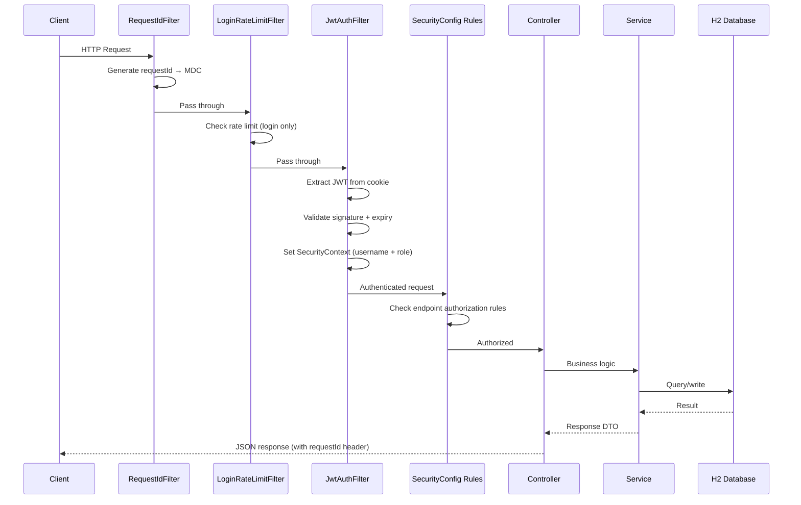
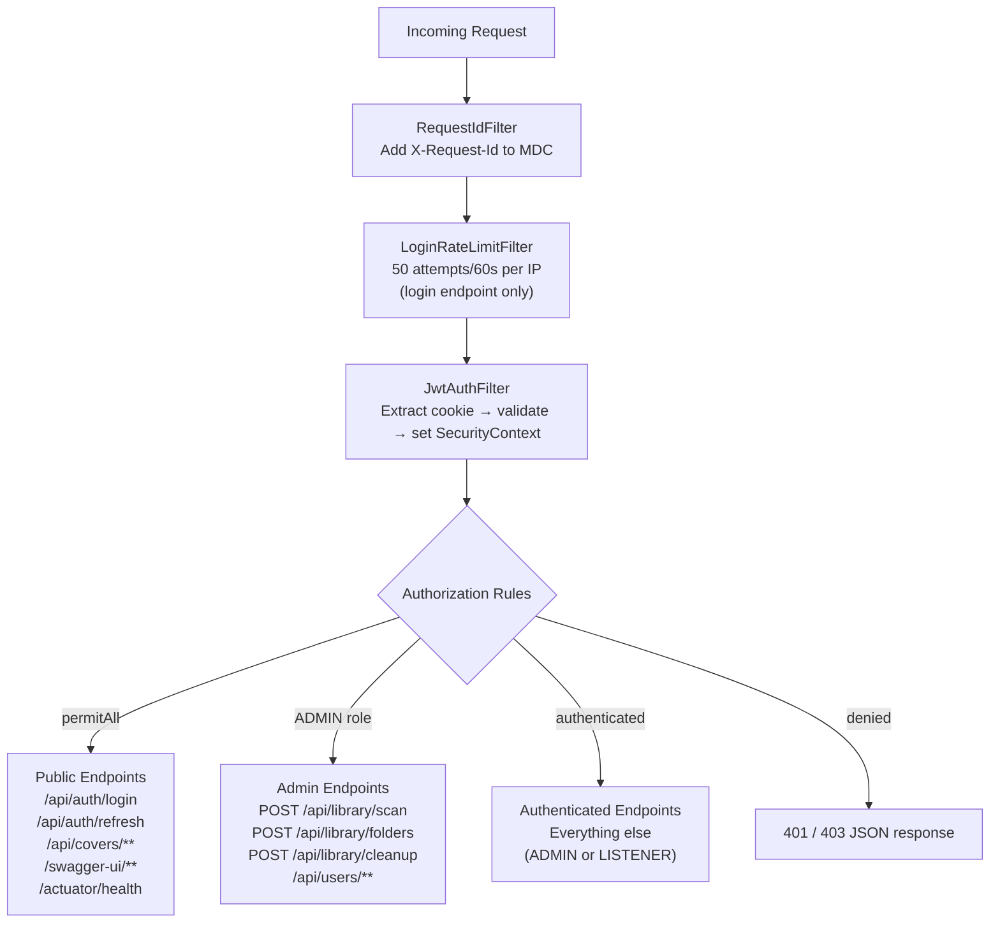
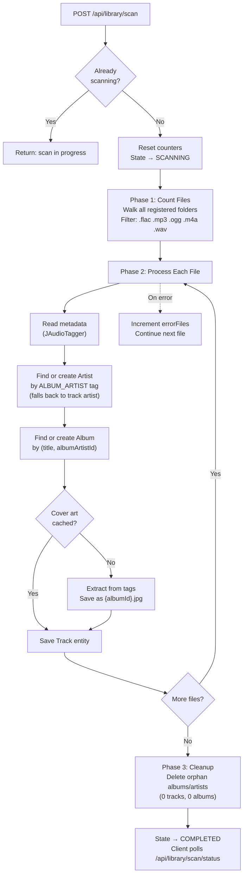
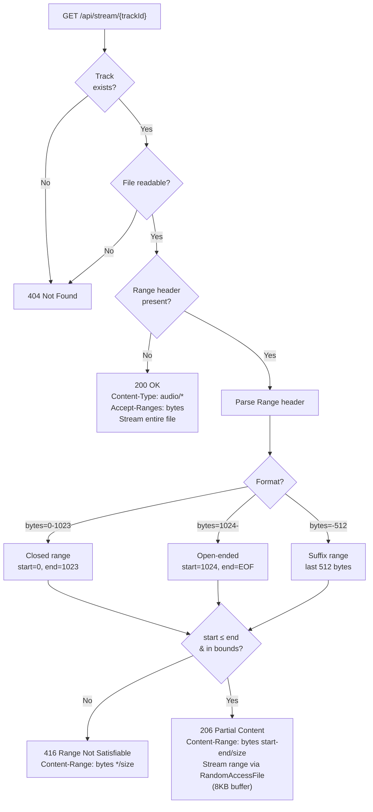
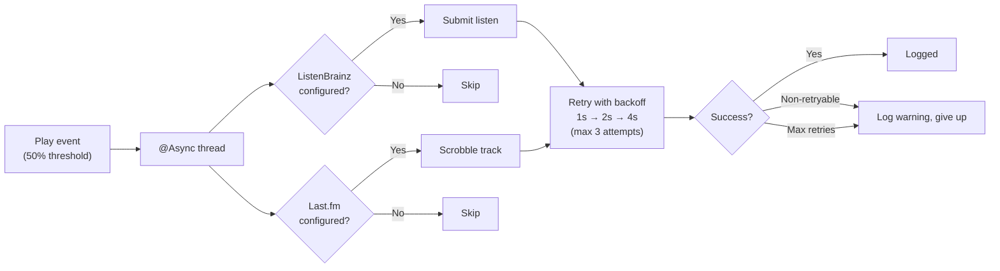

# Musicode Server

Spring Boot 3 backend for Musicode. Scans local music folders, reads audio metadata, streams files with HTTP Range support, manages authentication, tracks plays, and integrates with external scrobbling services.

## Tech Stack

| Component | Technology |
|---|---|
| Runtime | Java 21 + Spring Boot 3.4 |
| Security | Spring Security + JWT (JJWT 0.12.6) in HttpOnly cookies |
| Data | Spring Data JPA + H2 (embedded) + Flyway migrations |
| Metadata | JAudioTagger 2.2.5 (FLAC, MP3, OGG, M4A) |
| Docs | SpringDoc OpenAPI 2.8.14 (Swagger UI) |
| Real-time | Server-Sent Events (SseEmitter) |
| Async | Spring `@Async` with configurable thread pool |
| Crypto | AES-256-GCM for scrobble token encryption at rest |
| Logging | Logback with MDC request IDs (JSON in Docker) |
| Coverage | JaCoCo ≥80% enforcement |

## Running

```bash
# Dev mode
mvn spring-boot:run
# http://localhost:8080
# Swagger UI: http://localhost:8080/swagger-ui.html
# H2 Console: http://localhost:8080/h2-console (dev only)

# Tests (272 tests)
mvn clean verify
```

---

## Architecture

### Request Lifecycle



### Security Filter Chain



### Library Scan Process



### Audio Streaming (HTTP Range)



### Scrobble Pipeline



---

## API Reference

### Auth

| Method | Endpoint | Auth | Description |
|---|---|---|---|
| POST | `/api/auth/login` | none | Login, sets HttpOnly cookies. Body: `{ user, accessTokenExpiresIn }` |
| POST | `/api/auth/refresh` | refresh cookie | Rotate access + refresh tokens. Body: `{ user, accessTokenExpiresIn }` |
| POST | `/api/auth/logout` | access cookie | Revoke refresh token |
| GET | `/api/auth/me` | access cookie | Current user info |

### Library (ADMIN only for mutations)

| Method | Endpoint | Auth | Description |
|---|---|---|---|
| GET | `/api/library/folders` | any | List registered folders |
| POST | `/api/library/folders` | ADMIN | Add folder to scan |
| DELETE | `/api/library/folders/{id}` | ADMIN | Remove folder |
| POST | `/api/library/scan` | ADMIN | Start async library scan |
| GET | `/api/library/scan/status` | any | Scan progress (poll) |
| POST | `/api/library/cleanup` | ADMIN | Remove orphan tracks |

### Library Health (ADMIN)

| Method | Endpoint | Description |
|---|---|---|
| GET | `/api/library/health/summary` | Issue counts by type |
| GET | `/api/library/health/issues` | Paginated issues filtered by type |

### Browse

| Method | Endpoint | Description |
|---|---|---|
| GET | `/api/tracks?page,size,sort` | Paginated tracks |
| GET | `/api/tracks/{id}` | Track detail |
| GET | `/api/albums?page,size` | Paginated albums |
| GET | `/api/albums/{id}` | Album with tracks (EntityGraph) |
| GET | `/api/artists?page,size` | Paginated artists |
| GET | `/api/artists/{id}` | Artist with albums (EntityGraph) |
| GET | `/api/search?q=` | Combined search across tracks, albums, artists |
| GET | `/api/stream/{trackId}` | Audio stream (HTTP Range support) |
| GET | `/api/covers/{albumId}` | Cover art JPEG (7-day cache) |

### Lyrics & Waveforms

| Method | Endpoint | Description |
|---|---|---|
| GET | `/api/lyrics/{trackId}` | Get lyrics (synced LRC or plain text) |
| POST | `/api/lyrics/{trackId}/retry` | Retry failed lyrics fetch |
| GET | `/api/waveforms/{trackId}` | Waveform peaks for progress bar |

### Users (ADMIN)

| Method | Endpoint | Description |
|---|---|---|
| GET | `/api/users` | List all users |
| GET | `/api/users/{id}` | User detail |
| POST | `/api/users` | Create user |
| PUT | `/api/users/{id}` | Update user |
| DELETE | `/api/users/{id}` | Delete user |

### Playback & Stats

| Method | Endpoint | Description |
|---|---|---|
| POST | `/api/plays/{trackId}` | Record play event |
| GET | `/api/stats/top-artists?period,limit` | Top artists by play count |
| GET | `/api/stats/top-albums?period,limit` | Top albums by play count |
| GET | `/api/stats/top-tracks?period,limit` | Top tracks by play count |
| GET | `/api/stats/summary?period` | Total plays, listening time, unique counts |
| GET | `/api/stats/history?period` | Plays per day (Recharts-compatible) |

### Scrobble Settings (per user)

| Method | Endpoint | Description |
|---|---|---|
| GET | `/api/scrobble/settings` | Current scrobble config |
| PUT | `/api/scrobble/settings` | Connect Last.fm or ListenBrainz |
| DELETE | `/api/scrobble/settings/lastfm` | Disconnect Last.fm |
| DELETE | `/api/scrobble/settings/listenbrainz` | Disconnect ListenBrainz |

### Activity Feed

| Method | Endpoint | Description |
|---|---|---|
| GET | `/api/activity/stream` | SSE event stream (real-time plays) |
| GET | `/api/activity/recent` | Last 20 play events |

---

## Project Structure

```
src/main/java/com/musicode/
├── config/          Security, AdminSeeder, Async, Jackson, OpenAPI, LastFM, CORS, TokenMigration
├── controller/      16 REST controllers
├── exception/       GlobalExceptionHandler + custom exceptions (BadRequest, Conflict, NotFound)
├── filter/          JwtAuthFilter, LoginRateLimitFilter, RequestIdFilter
├── model/
│   ├── dto/         22 records (LoginRequest, UserResponse, StatsSummary, ActivityEvent, ...)
│   └── entity/      9 JPA entities (Track, Album, Artist, User, RefreshToken, PlaybackEvent,
│                    LibraryFolder, LyricsStatus, Role)
├── repository/      7 Spring Data JPA repositories
├── service/         17 services (Auth, JWT, Scan, Stream, CoverArt, Waveform, Lyrics,
│                    Stats, Scrobble, LastFM, ListenBrainz, Activity, Health, Metadata, ...)
└── util/            CookieUtil, TokenHashUtil, EncryptedStringConverter

src/test/java/       272 tests across 37 test classes
├── config/          AdminSeeder, TokenMigrationRunner
├── controller/      Integration tests for all 16 controllers
└── service/         Unit + WireMock contract tests for all services

src/main/resources/
├── application.yml          Dev config (H2 file, relaxed rate limits)
├── application-docker.yml   Docker profile (secure cookies, env secrets)
├── logback-spring.xml       Colored console (dev) / JSON (docker)
└── db/migration/
    ├── V1__baseline.sql     Schema: users, tracks, albums, artists, tokens, events, folders
    └── V2__add_lyrics_columns.sql
```

---

## Configuration

### Key Properties

| Property | Default | Description |
|---|---|---|
| `musicode.admin.default-password` | `changeme` | Initial admin password |
| `musicode.jwt.secret` | dev key | HS256 signing key (≥32 chars) |
| `musicode.jwt.access-token-expiration-ms` | `900000` | Access token TTL (15 min) |
| `musicode.jwt.refresh-token-expiration-ms` | `604800000` | Refresh token TTL (7 days) |
| `musicode.cookies.secure` | `false` | Cookie Secure flag (true in Docker) |
| `musicode.lastfm.api-key` | _(empty)_ | Last.fm API key |
| `musicode.lastfm.api-secret` | _(empty)_ | Last.fm API secret |
| `musicode.encryption.token-key` | _(env)_ | AES-256-GCM key for scrobble tokens |
| `musicode.security.login-rate-limit.max-attempts` | `50` | Login attempts per window |
| `musicode.security.login-rate-limit.window-seconds` | `60` | Rate limit window |
| `musicode.scrobble.retry-delay-ms` | `1000` | Base delay for exponential backoff |

Docker profile (`application-docker.yml`) overrides: `cookies.secure=true`, reads secrets from environment variables.

---

## Error Handling

All errors return consistent JSON via `@ControllerAdvice`:

```json
{
  "status": 404,
  "error": "Album not found with id: 42",
  "path": "/api/albums/42",
  "timestamp": "2026-03-31T10:00:00Z"
}
```

## Logging

| Mode | Format | Features |
|---|---|---|
| **Dev** | Colored console | `[requestId]` correlation, SQL formatting |
| **Docker** | JSON structured | Aggregation-ready, MDC fields included |

Every request gets a unique `X-Request-Id` (via `RequestIdFilter`) propagated through MDC for end-to-end tracing.

---

## Tests

```bash
mvn clean verify   # Runs all 272 tests + JaCoCo coverage check
```

| Category | Count | Description |
|---|---|---|
| **Controller integration** | ~110 | `@WebMvcTest` with `@WithMockUser`, real filter chain |
| **Service unit** | ~120 | Mockito-based, logic isolation |
| **Contract (WireMock)** | ~40 | Last.fm + ListenBrainz wire format validation |
| **Config** | ~4 | AdminSeeder, TokenMigrationRunner |

WireMock contract tests validate actual HTTP request bodies, signatures, and headers — catching wire format bugs that Mockito tests can't see.
