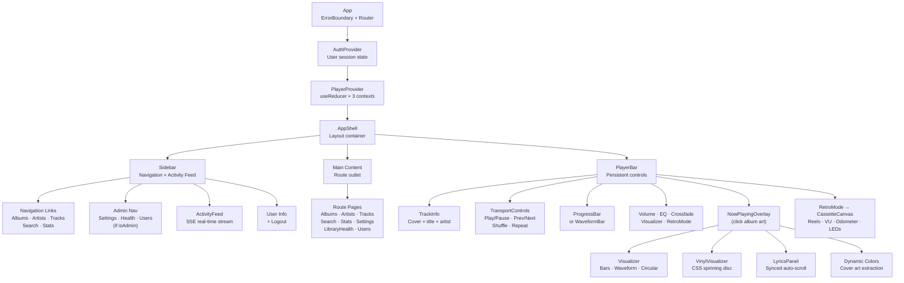
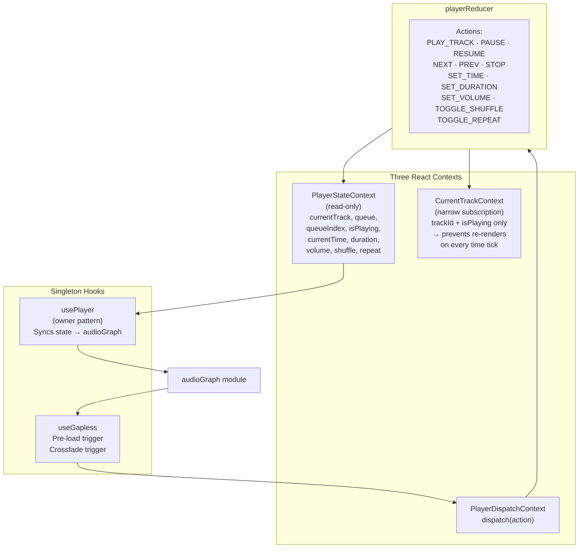
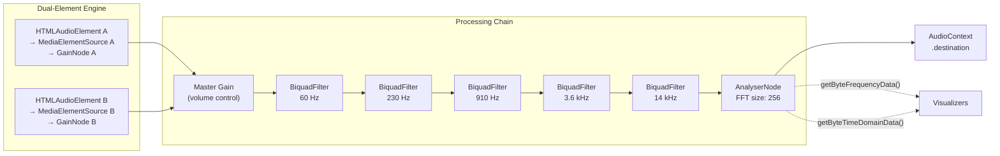
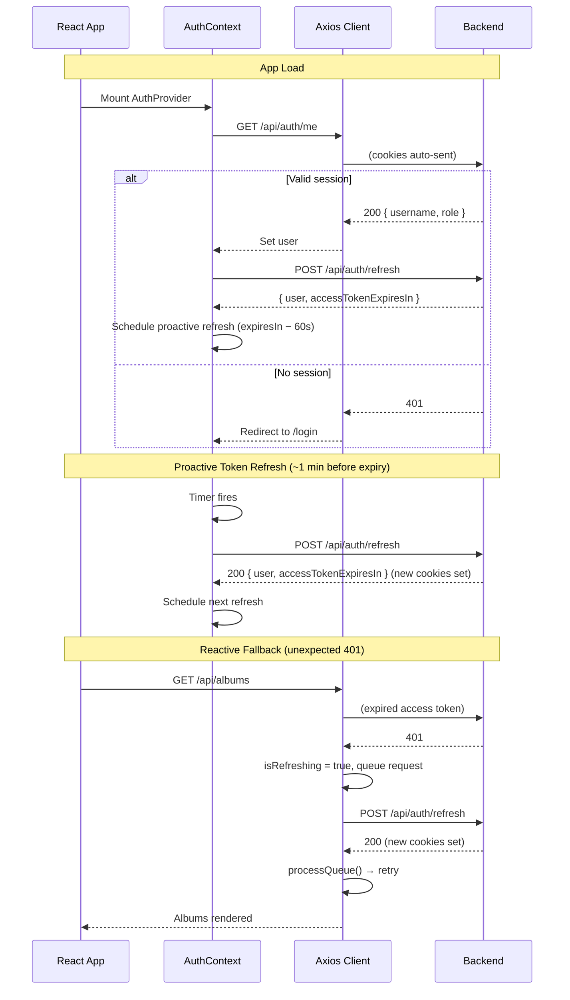

# Sonance UI

React frontend for Sonance. Browse your music library, play tracks with gapless playback and crossfade, visualize audio in real-time, manage scrobbling, and track your listening stats — all in a dark-themed responsive SPA.

## Tech Stack

| Component | Technology |
|---|---|
| Framework | React 19 + TypeScript |
| Build | Vite 8 |
| Styling | Tailwind CSS v4 |
| Server State | TanStack Query |
| HTTP Client | Axios (with auth interceptor) |
| Charts | Recharts |
| Icons | Lucide React |
| Unit Tests | Vitest + v8 coverage |
| E2E Tests | Playwright |

## Running

```bash
npm install
npm run dev            # Dev server on http://localhost:5173
npm run build          # Production build to dist/
npm run preview        # Preview production build
npm test               # Run unit tests
npm run test:coverage  # Tests with coverage thresholds
npm run test:e2e       # Playwright E2E (requires backend on :8080)
npm run test:e2e:ui    # Playwright with interactive UI
```

The dev server proxies `/api` requests to `http://localhost:8080` (Spring Boot).

---

## Architecture

### Component Hierarchy



### Player State Architecture



**Why three contexts?** Components that only care about "which track is playing" (like the sidebar highlight) subscribe to `CurrentTrackContext` and don't re-render on every `currentTime` tick. Components that need full state (like `PlayerBar`) subscribe to `PlayerStateContext`. Dispatch is separate so state-reading components don't re-render when the dispatch function reference changes.

### Audio Pipeline



**Gapless mechanism:** While element A plays, element B pre-loads the next track in the queue. At transition time:
- **Instant swap:** GainA → 0, GainB → 1 (flip in one frame)
- **Crossfade:** `linearRampToValueAtTime()` over configurable 0-12s duration

Both elements are permanently wired — no connect/disconnect race conditions.

### Auth Flow



**Proactive refresh** keeps the access token cookie valid continuously — `<audio>` streaming and SSE connections (which bypass axios) never hit a 401. The reactive interceptor remains as a safety net for edge cases.

---

## Pages

| Route | Component | Auth | Description |
|---|---|---|---|
| `/login` | LoginPage | public | Username + password form |
| `/` | AlbumsPage | any | Album grid with cover art |
| `/albums/:id` | AlbumDetailPage | any | Album with track list |
| `/artists` | ArtistsPage | any | Artist list |
| `/artists/:id` | ArtistDetailPage | any | Artist with albums |
| `/tracks` | TracksPage | any | Paginated track table |
| `/search` | SearchPage | any | Combined search (tracks, albums, artists) |
| `/stats` | StatsPage | any | Listening statistics dashboard |
| `/settings` | SettingsPage | ADMIN | Library folders, scan, scrobble config |
| `/settings/health` | LibraryHealthPage | ADMIN | Library health issues dashboard |
| `/users` | UsersPage | ADMIN | User management (CRUD) |

---

## Features

### Player Controls

| Control | Behavior |
|---|---|
| **Play / Pause** | Toggle playback, Media Session integration |
| **Previous** | Restart if >3s in, else previous track |
| **Next** | Next in queue, respects repeat mode |
| **Shuffle** | Fisher-Yates shuffle, preserves original queue order for un-shuffle |
| **Repeat** | Cycles: off → all → one |
| **Volume** | 0-100% slider, persisted in localStorage |
| **Seek** | Click/drag on progress bar or waveform bar |
| **Crossfade** | 0-12s configurable overlap between tracks |
| **5-Band EQ** | 60Hz, 230Hz, 910Hz, 3.6kHz, 14kHz with 5 presets |
| **Keyboard** | Space (play/pause), Arrow Right/Left (next/prev), M (mute) |
| **Media Session** | OS media keys, now-playing notification with cover art |

### Visualizer Modes

| Mode | Rendering | Data Source |
|---|---|---|
| **Frequency Bars** | Vertical bars, HSL color by amplitude | `getByteFrequencyData()` |
| **Waveform** | Smoothed line with glow effect | `getByteTimeDomainData()` + lerp |
| **Circular** | 64 radial bars with inner gradient | `getByteFrequencyData()` grouped |
| **Vinyl** | CSS spinning disc with cover art | CSS animation + transition |

Canvas modes run at 60fps via `requestAnimationFrame`. They pause on `document.hidden` and fade out when playback stops.

### Cassette Deck (Retro Mode)

Full-screen animated cassette tape experience rendered on a virtual 1000x635 canvas:

- **Spinning reels** — Angular velocity = linearSpeed / radius (realistic)
- **VU meters** — Needle deflection driven by frequency data
- **Odometer** — Mechanical digit roller showing elapsed time
- **LED indicators** — Play/pause/record state
- **3 visual themes** — Switchable deck aesthetics
- **Cover art label** — Album cover embedded in cassette label with text overlay

### Dynamic Colors

Album artwork is sampled to a 64x64 canvas, pixels are quantized into 512 color buckets, and scored by `sqrt(count) * (1 + saturation * 2)`. The top-scoring colors become the UI theme — progress bar, visualizer, overlay, and cassette deck all adapt.

### Synced Lyrics

- Fetched from `/api/lyrics/{trackId}`
- LRC format parsed with millisecond timing
- Active line highlighted and auto-scrolled
- Manual scroll pauses auto-scroll for 4 seconds
- States: Loading → Not Found / Instrumental / Synced / Plain Text
- Retry button for failed fetches

### Waveform Progress Bar

Server-generated waveform peaks rendered as the seek bar. Falls back to a standard progress bar if waveform data is unavailable.

### Activity Feed

Real-time SSE (`EventSource`) in the sidebar showing recent plays across all users. Falls back to polling `/api/activity/recent` on reconnect.

### Listening Stats

| Component | Data |
|---|---|
| **Summary cards** | Total plays, listening time, unique artists, unique albums |
| **Daily chart** | Plays-per-day bar chart (Recharts) |
| **Top artists** | Ranked by play count |
| **Top albums** | Ranked by play count |
| **Top tracks** | Ranked by play count |
| **Period filter** | Week, Month, Year, All Time |

### Responsive Layout

- Sidebar collapses from 224px to 64px (icon-only mode)
- Breakpoint-aware toggle with smooth CSS transition
- Player bar adapts layout for narrow viewports
- Activity feed hidden when sidebar collapsed

---

## Project Structure

```
src/
├── api/              API functions + Axios client with auth interceptor
│                     (withCredentials: true, 401 refresh queue)
├── assets/           Static assets
├── audio/
│   ├── audioGraph.ts       Dual-element Web Audio graph (singleton module)
│   ├── audioPreferences.ts localStorage persistence for player settings
│   ├── eqProcessor.ts      5-band parametric EQ (BiquadFilterNodes)
│   └── colorExtraction.ts  Cover art → color palette (canvas quantization)
├── components/
│   ├── activity/     ActivityFeed (SSE EventSource)
│   ├── auth/         ProtectedRoute (role-based redirect)
│   ├── common/       Spinner, ErrorMessage, ErrorBoundary
│   ├── layout/       AppShell, Sidebar, TopBar
│   ├── library/      AlbumCard, TrackList
│   └── player/
│       ├── PlayerBar.tsx           Persistent bottom controls
│       ├── TransportControls.tsx   Play/Pause/Prev/Next/Shuffle/Repeat
│       ├── ProgressBar.tsx         Standard seek bar
│       ├── WaveformBar.tsx         Waveform-rendered seek bar
│       ├── VolumeControl.tsx       Volume slider
│       ├── EqPopover.tsx           5-band EQ with presets
│       ├── CrossfadePopover.tsx    Crossfade duration config
│       ├── Visualizer.tsx          Bars/Waveform/Circular (Canvas 2D)
│       ├── VinylVisualizer.tsx     CSS spinning disc
│       ├── NowPlayingOverlay.tsx   Full-screen immersive view
│       ├── LyricsPanel.tsx         Synced lyrics with auto-scroll
│       ├── TrackInfo.tsx           Album art + track details
│       ├── ScrobbleIndicator.tsx   Sync status badge
│       ├── RetroMode.tsx           Cassette deck entry point
│       └── cassette/
│           ├── CassetteCanvas.tsx  Main canvas renderer
│           ├── VUMeter.tsx         Frequency-driven VU needles
│           ├── Odometer.tsx        Mechanical digit roller
│           ├── DeckLEDs.tsx        Play/pause/record indicators
│           ├── DeckTransport.tsx   Tape transport controls
│           └── DeckThemeToggle.tsx Theme switcher
├── context/
│   ├── AuthContext.tsx    Login/logout/restore + useAuth() hook
│   └── PlayerContext.tsx  useReducer + dual contexts + usePlayer/useGapless
├── hooks/
│   ├── usePlayer.ts          Owner-pattern singleton, state→audioGraph sync
│   ├── useGapless.ts         Pre-load + crossfade trigger logic
│   └── useAudioAnalyser.ts   AnalyserNode access for visualizers
├── pages/            Route components (11 pages)
├── types/            TypeScript interfaces
└── utils/
    ├── errors.ts     Error extraction (backend ErrorResponse → string)
    └── format.ts     Duration formatting (seconds → mm:ss)
```

---

## Key Patterns

### Owner-Based Singleton (usePlayer)

Multiple components call `usePlayer()`, but only one "owns" the `audioGraph` lifecycle. The first caller claims ownership via a module-level `Symbol` ref. The owner wires callbacks (timeupdate, ended, loadedmetadata) and syncs React state to the audio graph. Other callers get read-only access through context.

### Dual Contexts for Performance

`PlayerStateContext` (full state) and `CurrentTrackContext` (trackId + isPlaying) are separate. The sidebar's "now playing" indicator subscribes only to `CurrentTrackContext`, so it doesn't re-render 4 times per second on `currentTime` updates.

### Callback Routing in audioGraph

Both HTMLAudioElements fire `timeupdate` and `ended`. The graph module checks which element is active before dispatching callbacks — no need to add/remove listeners on swap.

### Preload-Triggered Transitions

`useGapless` registers a `setOnTimeUpdate` callback. When remaining time drops below the preload threshold, it calls `prepareNext()`. When remaining time drops below the crossfade duration, it initiates the crossfade or instant swap. Single event source driving multiple state machines.

---

## Error Handling

| Layer | Strategy |
|---|---|
| **ErrorBoundary** | Wraps entire app — catches React runtime crashes, shows reload UI |
| **ErrorMessage** | Reusable component with optional retry button |
| **getErrorMessage()** | Extracts backend `ErrorResponse.error` field or provides fallback text |
| **Axios interceptor** | 401 → transparent refresh with request queue; refresh failure → redirect to login |

---

## Tests

```bash
npm run test:coverage    # 117 unit tests with coverage thresholds
npm run test:e2e         # 21 Playwright E2E tests (requires backend on :8080)
npm run test:e2e:ui      # Playwright E2E with interactive UI
```

### Unit Tests (Vitest)

Coverage thresholds enforced on `context/` and `utils/` (lines ≥80%, branches ≥80%, functions ≥50%). Components, pages, hooks, and API layer excluded from thresholds — tested via E2E integration.

### E2E Tests (Playwright)

21 tests covering: authentication, album/artist/track browsing, playback controls, admin settings, search, navigation, stats dashboard, error states.

Config: single worker, sequential execution, HTML reporter, screenshots + traces on failure. Backend must be running on `:8080`.
